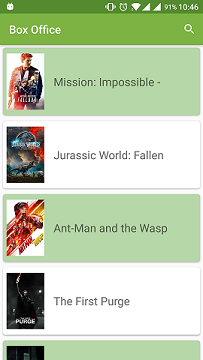
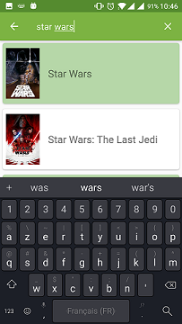
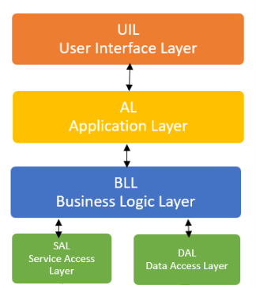
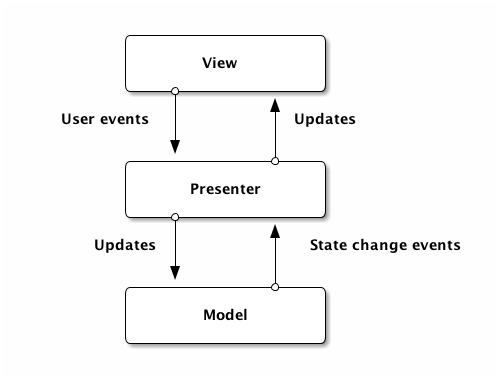

# Boxotop

## Overview

**Boxotop** est une application de test présentant les films au box office.

3 fonctionnalités majeurs ont été développées :

- Ecran du **Box Office** (écran par défaut)  listant les films actuellement au cinéma :

  

  

- Ecran de recherche **Search**. L'utilisateur peu effectuer une recherche de films par titre et obtient le résultat sous forme de liste :

  

  

- Ecran de détail de film **Movie Details** donnant le détails d'un film :

## Architecture du code

### Les couches

J'ai commencé à implémenter une architecture en 4 couches : 

Dans le dossier Java, vous pourrez remarquer 2 dossiers :

- **UIL** (User Interface Layer) : couche de l'interface utilisateur
- **SAL** (ServiceAccess Layer) : couche de communication avec l'API

J'ai commencé à implémenter ce pattern mais par manque de temps, je n'ai réaliser que 2 des 5 couches nécessaires. Il manque :

- **AL** (Application Layer) : fais le lien entre l'application et la BLL.

- **DAL** (Data Access Layer) : couche de base de données locale

- **BLL** (Business Access Layer) : choisis qui contacter entre la DAL et la SAL pour obtenir une donnée. Il permet aussi de

  

Ce pattern permet d'avoir une flexibilité pour l'application. En effet, si l'API change pour obtenir les informations sur les films, **seulement** la couche SAL sera modifiée **sans impacter** les autres couches et donc sans impacter sur le code de l'application.

Dans une version future, je pourrai réaliser les couches manquantes.

### Le modèle MVP

Pour l'application, j'ai choisis d'implémenter le modèle MVP : **Model View Presenter** : 

Pour cette raison le projet sous le dossier UIL est organisé de cette façon : 

- **Model** : un dossier Model se trouve tout le modèle de l'application. Pour le futur, ce modèle sera placé dans la couche **AL** et la couche **SAL, BLL et DAL** auront leur propre modèle.

- **View** : un dossier *Activité* et un dossier *Fragment*. L'*Activité* n'est qu'un conteneur pour le fragment. Toute la logique de la vue se trouve dans le fragment.
- **Presenter** : un dossier *Presenter* contient les différents présenteur

Pour que les communications entre **View** et **Presenteur** se fassent, des *Contrats* ont été défini dans le dossier **Contracts** sous forme d'interface

## API

### Le choix

Comme je souhaitais afficher le Box Office, j'ai choisis l'API TMDB (The Movie DataBase).

Cette API est plus complète que celle proposée dans le sujet.

### Implémentation

J'ai utilisé Rétrofit avec gestion du cache our communiquer avec l'API.

## Résultat

### Les bugs 

Voici une liste de bug connu : 

- Retour après une recherche : la liste est vide et l'application affiche un écran vide
- Pendant une recherche, des cases vides s'affiche de temps en temps

Pour corriger ces bugs, il faudra séparer la recherche de l'écran **Box Office**.

### Limitations

Comme je n'ai pas eu assez de temps, l'UI de la partie **Movie Details** est rapide et très simple.

### Les futures améliorations possibles

Voici une liste non-exhaustive des améliorations pouvant être apportée au projet :

- [ ] Terminer l'implémentation 4 couches
- [ ] Séparer en deux fragments la liste **Box Office** et les résultats de la **Search**
- [ ] Afficher un message d'erreur lorsque la recherche ne donne aucun résultat
- [ ] Animer le **Splash Screen**
- [ ] Récupérer la donnée depuis l'API selon la langue de l'utilisateur
- [ ] Utiliser un RefreshLayout pour refresh les pages
- [ ] Sauvegarder tous les appels API en base de données
- [ ] Améliorer l'UI du **Movie Details** :
  - [ ] Placer le **Movie Details** dans un *ViewPager* afin de laisser l'utilisateur swiper pour voir les films suivants dans la liste
  - [ ] Trouver une API alternative pour télécharger une image poster de qualité
  - [ ] Ajout d'un scrim pour rendre le titre lisible
  - [ ] Proposer une Vue supplémentaire pour afficher le casting en photos dans une grille
  - [ ] Proposer une liste de films similaires
  - [ ] Proposer à l'utilisateur de pouvoir voter

